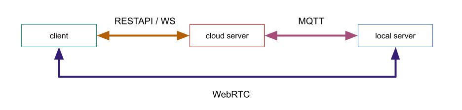
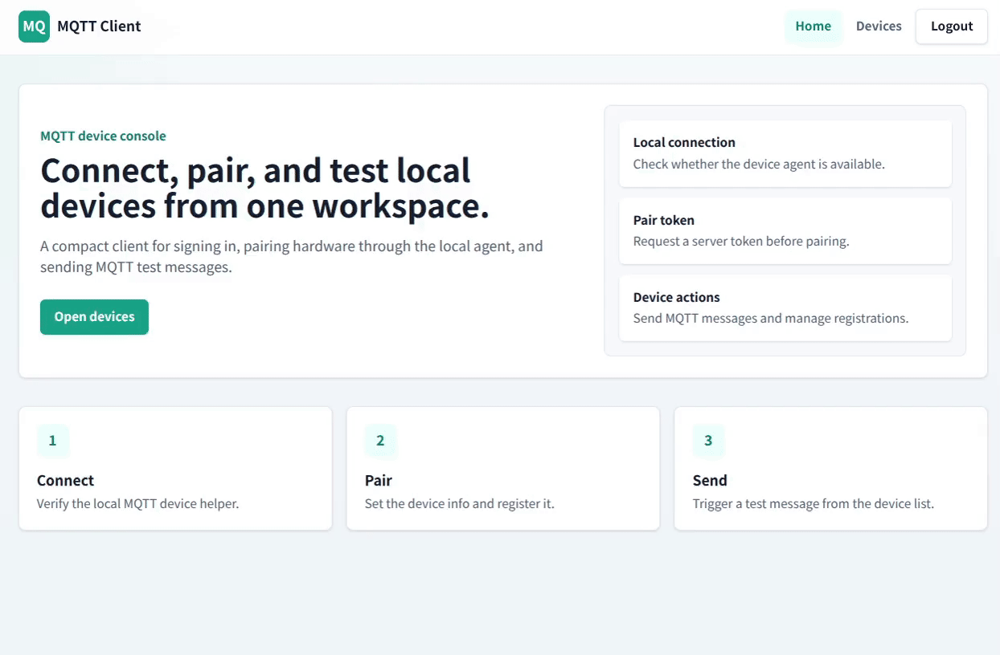
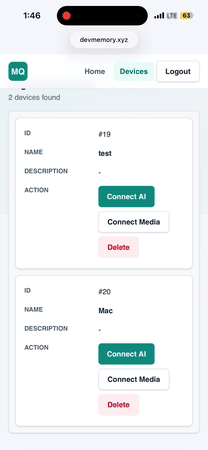
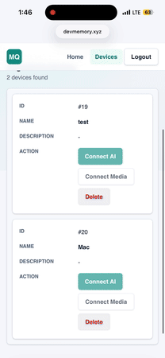

<p>
  <a href="./README.md">English</a> | <strong>한국어</strong>
</p>

# 🌐 portfolio-device-sync

> **리버스 터널링**과 **p2p** 통신을 활용하여 비용제약, 환경제약을 극복하기 위해 만들어본 프로젝트 입니다.

블로그 포스트: https://devmemory.tistory.com/category/Side%20project  
라이브 데모: https://www.devmemory.xyz/  
- Hetzner cloud(독일 지역)에 배포되어 있어 한국에서 테스트할 때 지연이 있습니다.
- 실기기 테스트를 원하시면 devmemorydh@gmail.com 로 로컬서버 파일 요청 해주시면 됩니다.(ffmpeg필수)

---

### 아키텍쳐 요약


---

### 실행 화면
#### Pairing, WebRTC, AI chatting





---

### 제약조건
1. 유저는 네트워크 장비(공유기)를 건드리지 않게 할 것
2. 보안에 문제를 최대한 신경 쓸 것
3. Double NAT 환경에서도 안정적으로 연결할 것

---

## 🚀 핵심 설계 부분
제약 조건, 프로토콜 선택 시의 트레이드오프, 그리고 WebRTC NAT Traversals에 대해 깊이 있게 다룹니다. 기존의 편리한 기성 설정을 선택하는 대신, 분산 시스템에서 발생하는 핵심 병목 현상을 직접 해결하는 데 집중했습니다.

### 1. 디바이스 페어링 제약 조건 및 해결 방안
* **Web BLE의 한계:** BLE(Bluetooth Low Energy)는 헤드리스 디바이스의 프로비저닝에 이상적이지만, 엄격한 웹 브라우저 보안 정책과 Web Bluetooth API의 불완전한 지원으로 인해 실제 도입에는 큰 장벽이 존재합니다.
* **mDNS 호스트 네임 충돌:** 동일한 로컬 네트워크에 동일한 mDNS를 publish하면 호스트 네임 충돌이 발생합니다.
* **네트워크 제약:** mDNS는 공유기 설정 (AP Isolation, IGMP Snooping 차단)에 따라 접근이 불가능한 경우가 많습니다.
* **해결방안:** 대부분 IoT회사에서 활용하는 QR, pin code로 fallback을 처리합니다.

### 2. 프로토콜 아키텍처: 왜 MQTT 대신 AMQP인가?
엣지 디바이스 환경에서 흔히 쓰이는 MQTT 대신, 본 프로젝트는 네트워크 불안정성을 극복하고 확실한 시그널링 QoS를 보장하기 위해 AMQP(RabbitMQ)를 채택했습니다.   
* **MQTT의 한계 (연결 유실 시 데이터 휘발):** 가볍다는 장점이 있지만, 엣지 디바이스의 빈번한 연결 유실 및 복구 과정에서 메시지가 유실될 위험이 큽니다. 노드가 일시적으로 오프라인일 때 발송된 중요 시그널링 패킷이 휘발되어 시그널링에 문제가 생길 수 있습니다.
* **AMQP의 강점 (지속성 큐 기반의 QoS 보장):** 강력한 지속성 메시지 큐를 지원합니다. 엣지 디바이스가 일시적으로 단절되어도 브로커가 패킷을 보관하며, 연결 회복 후 명시적으로 ACK를 보낼 때까지 유지합니다. 또한 복잡한 토픽 관리 없이 전용 큐만 구독하면 되므로 상태 관리가 단순해집니다.

### 3. 안전한 시그널링 및 엄격한 SDP 조율
* **계정 유출 위험 완화:** 페어링 세션마다 임시 계정을 발급하는 방식은 심각한 보안 위험과 리소스 누수를 유발할 수 있습니다. 이를 방지하기 위해 모든 시그널링 트래픽은 **클라이언트 ⇄ WebSockets (Socket.IO) ⇄ 클라우드 게이트웨이 (NestJS) ⇄ AMQP/MQTT ⇄ 로컬 서버**로 이어지는 안전하고 영구적인 허브를 통해 라우팅되며, 엣지 디바이스의 인증 정보를 완전히 격리합니다.
* **엄격한 SDP 조율:** 웹 브라우저는 SDP협상을 쉽게 할 수 있도록 히든 레이어를 내장하고 있습니다. 반면, Node.js 미디어 서버는 WebRTC 핸드셰이크 과정에서 **매우 엄격하게** 동작 하므로, 협상 실패를 막기 위해 Media Descriptions을 수동으로 정밀하게 맞춰주어야 합니다.

### 4. 카메라 핸들링 (FFmpeg)
* 엣지 디바이스에서 가공되지 않은 비디오 프레임을 직접 캡처하려면, 최적화된 **FFmpeg 하위 프로세스(spawn process)**를 통해 OS 수준의 미디어 파이프라인을 직접 제어해야 합니다.
* 여기서 핵심 과제는 OS별 하드웨어 캡처 드라이버(예: Linux의 V4L2, macOS의 AVFoundation)와 WebRTC의 미디어 간의 **코덱 불일치**를 해결하는 것입니다. 이를 위해 런타임에서 정확한 타깃 구성(VP8)을 강제하도록 구현했습니다.

### 5. WebRTC NAT 통과 및 연결성
* 복잡한 로컬 라우터 설정, NAT, 그리고 엄격한 방화벽으로 문제로 인해, 실제 배포 환경의 네트워크에서는 표준 Peer-to-Peer STUN 핸드셰이크가 실패하는 경우가 빈번합니다.
* 100%의 연결성을 보장하기 위해, 전용 최적화 **CoTURN (TURN/STUN) 서버**를 인프라에 도입했습니다. 다이렉트 Hole-Punching에 실패할 경우 암호화된 미디어 스트림이 릴레이 서버를 경유하도록 폴백 라우팅을 구성했습니다.
* **TURN 자격 증명 노출 및 보안 정책:** TURN 서버의 고정 자격 증명을 클라이언트에 그대로 노출하는 것은 심각한 보안 취약점(서버 자원 도용 등)을 유발합니다. 이를 방지하기 위해 클라우드 게이트웨이에서 만료 시간(TTL)이 적용된 임시 인증 토큰을 동적으로 생성하여 클라이언트에 안전하게 서빙하는 방식으로 보안 리스크를 제거했습니다.

### 6. 최대 전송 단위 (MTU) 최적화
* **기본 MTU:** 표준 기본 MTU는 1500바이트입니다. 그러나 이는 모바일 네트워크나 대역폭이 낮은 환경에서 패킷 단편화 및 전송 문제를 일으킬 수 있습니다.
* **모바일 및 저속 네트워크 최적화:** 네트워크가 제한된 환경에서 비디오가 끊기거나 패킷 손실이 발생하는 것을 방지하기 위해 MTU를 1200바이트로 최적화했습니다.
* **모바일 네트워크 오버헤드:** 셀룰러 프로토콜 오버헤드를 수용할 수 있도록 모바일 환경에 특화된 MTU 상한선을 1320바이트로 상정하고 설계해야 합니다.

---

## 🏗️ 개발 환경

### 클라이언트 (React 19 / Vite)
- 안전한 모바일 앱/웹 레이어를 사용하여 세션을 인증하고 페어링 요청을 트리거합니다.
- 실시간 시그널링을 위해 클라우드 서버와 표준 Socket.IO 연결을 합니다.
- 엣지 디바이스에서 보내주는 미디어 정보를 WebRTC를 통해 전달받고, 시각화 합니다.

### 클라우드 (NestJS 11)
- 사용자/디바이스 관계를 관리(PostgreSQL 16)하고 임시 페어링 검증 조회를 처리합니다.
- 양방향 시그널링 역할을 수행합니다: WebSockets 페이로드 데이터를 안전하게 격리된 RabbitMQ 익스체인지/큐 파이프라인으로 변환합니다.
- NAT 통과를 위한 동적 CoTURN 자격 증명을 발급합니다.

### 로컬 서버 (Node.js / Express)
- `node-machine-id`와 mDNS를 조합한 고유 식별자를 사용하여 하드웨어 무결성을 확보합니다.
- 외부 방향(Outbound)으로만 유지되는 RabbitMQ 아웃바운드 AMQP 연결을 맺어, 인바운드 노출없이 시그널링 패킷을 안전하게 구독합니다.
- `FFmpeg` 파이프라인을 구동하여 카메라 프레임을 캡처하고, `werift`를 통해 브라우저로 실시간 미디어를 스트리밍합니다.

---

## 🔒 보안 및 샌드박스 격리 전략

실제 운영 환경의 자격 증명, 홈 서버 경로 또는 Hetzner 마스터 API 키 등이 노출되는 것을 방지하기 위해, 별도 환경 설정은 **샌드박스**로 작동합니다.

---

## 📂 폴더 구조

```text
.
├── client/                    # React 19 / Vite 웹 대시보드
│   ├── public/                # 정적 에셋
│   ├── src/
│   │   ├── components/        # 공통 UI 컴포넌트
│   │   ├── constants/         # 클라이언트 측 상수
│   │   ├── hooks/             # 재사용 가능한 React 훅
│   │   ├── models/            # 프론트엔드 데이터 모델
│   │   ├── routes/            # 인증, 디바이스, 연결 및 앱 라우트
│   │   ├── services/          # REST, Socket.IO 및 WebRTC 클라이언트
│   │   └── utils/             # 클라이언트 유틸리티
│   ├── package.json
│   └── vite.config.ts
├── cloud/                     # NestJS 11 제어 평면 및 시그널링 브릿지
│   ├── src/
│   │   ├── common/            # 가드, 필터, DTO, 응답 및 유틸리티
│   │   ├── infrastructure/    # AMQP 및 Redis 연동 모듈
│   │   ├── modules/           # 디바이스 및 사용자 도메인 모듈
│   │   ├── app.module.ts
│   │   └── main.ts
│   ├── Dockerfile
│   ├── docker-compose.yml
│   └── package.json
├── local/                     # Node.js 엣지 디바이스 컨트롤러
│   ├── src/
│   │   ├── constants/         # 로컬 상수
│   │   ├── controller/        # 디바이스, 라이프사이클, 메시지 및 WebRTC 컨트롤러
│   │   ├── models/            # MQ, 결과 및 WebRTC 모델
│   │   ├── routes/            # 로컬 HTTP 라우트
│   │   ├── util/              # FFmpeg 유틸리티
│   │   └── index.ts
│   └── package.json
├── document/                  # 데이터베이스 설계 문서
│   ├── ddl
│   └── erd.vuerd.json
└── README.md
```

## 💻 Quick Start
### 1. Install Dependencies
해당 디렉토리에서 의존성 파일을 설치합니다:
```bash
cd cloud && yarn install
cd ../client && yarn install
cd ../local && yarn install
```

### 2. 클라우드 인프라 및 API 설정
cloud 디렉토리로 이동하여 핵심 인프라를 실행합니다.
cd cloud
```
# Build and run PostgreSQL, Redis, RabbitMQ, and Coturn in the background
docker compose up -d --build
```

💡 데이터베이스 초기화: TypeORM은 synchronize: false로 설정되어 있습니다. 데이터베이스 컨테이너가 정상적으로 구동되면, PostgreSQL에 접속하여 document 디렉토리에 있는 DDL 스크립트를 실행해 스키마를 초기화해 주세요.

💡 RabbitMQ 관리 플러그인:
RabbitMQ가 완전히 초기화될 때까지 몇 초간 기다린 후, 다음 명령어를 실행하여 관리 UI(Management UI)를 활성화합니다.

```
docker exec -it rabbitmq rabbitmq-plugins enable rabbitmq_management
```

클라우드 API는 http://localhost:8080 으로, RabbitMQ 관리는 http://localhost:15672 로 접속할 수 있습니다.

### 3. 로컬 에이전트 설정 (엣지 디바이스)
로컬 에이전트가 로컬 네트워크에 자신의 존재를 브로드캐스트하려면 mDNS (Bonjour) 데몬 지원이 필요합니다.

- Linux (Ubuntu/Debian) 환경: 에이전트를 실행하기 전에 avahi-daemon을 설치하고 활성화합니다.
```
sudo apt update && sudo apt install -y avahi-daemon avahi-utils
sudo systemctl enable avahi-daemon
sudo systemctl start avahi-daemon
```

- macOS 환경: 별도의 설정이 필요하지 않습니다 (OS에서 Bonjour를 네이티브로 지원합니다).

시스템 PATH에 FFmpeg가 설치되어 있고 사용 가능한지 확인한 후 에이전트를 시작합니다.
